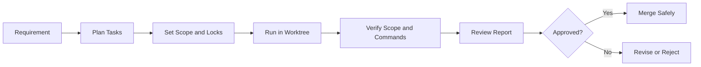

# ScopeGuard

Safety orchestration for AI coding workflows.

[简体中文](./README.zh-CN.md)

ScopeGuard helps you run AI-generated code changes with clearer boundaries, safer parallelism, and more reviewable outputs.

It is not a coding model.
It works alongside Codex, Claude Code, Cursor, and other coding assistants.

## In One Sentence

ScopeGuard helps you manage the risk of AI-written code before it reaches your main branch.

## Why It Exists

AI coding tools are great at making changes.
They are much less reliable at staying inside file boundaries, coordinating parallel work, and producing changes that are easy to verify before merge.

That usually shows up as:

- agents editing more files than expected
- overlapping changes between parallel tasks
- generated artifacts mixed into source diffs
- hard-to-review working tree changes
- unsafe merges after "successful" AI output

ScopeGuard adds a safety layer around that workflow.

## Without vs With ScopeGuard

Without ScopeGuard:

- ask an AI tool to make a change
- inspect a large diff after the fact
- discover scope drift during review or merge
- manually untangle overlapping work between tasks

With ScopeGuard:

- define the task and file boundaries up front
- isolate work in a dedicated git worktree
- verify whether the change stayed in scope
- generate a review artifact before approval and merge

## What ScopeGuard Does

- Breaks work into scoped tasks with explicit file boundaries.
- Prevents unsafe parallelism with file locks and task dependencies.
- Runs work in isolated git worktrees.
- Verifies whether a task stayed within its allowed scope.
- Generates a human review report before approval and merge.
- Supports working-tree verification when changes were made directly in the current repo.

## Who It Is For

ScopeGuard is most useful when:

- you rely heavily on AI coding tools in a real repository
- multiple tasks may run in parallel
- you want safer review and merge discipline around AI-generated changes
- you need more than "the model said it was done"

It is probably overkill for:

- tiny scripts
- one-file edits
- casual exploratory prompting without review requirements

## Core Idea

ScopeGuard does not try to replace your coding assistant.

It helps turn AI coding from a one-shot generation step into a controlled engineering workflow:

`plan -> scope -> run -> verify -> review -> approve -> merge`

## Typical Workflow

1. Describe the requirement and generate a task plan.
2. Import tasks with explicit allowed files, locks, and dependencies.
3. Run one task in an isolated worktree.
4. Verify the result before trusting it.
5. Review the generated diff and report.
6. Approve and merge only after scope and review checks pass.



## Quick Start

```powershell
pnpm install
pnpm build
pnpm --filter @scopeguard/cli dev -- init
pnpm --filter @scopeguard/cli dev -- scan
pnpm --filter @scopeguard/cli dev -- doctor
pnpm --filter @scopeguard/cli dev -- smoke
```

## Smallest Useful Entry Point

If you do not want the full task workflow yet, start with verification and review:

```powershell
scopeguard verify T-001 --working-tree
scopeguard review T-001 --working-tree
scopeguard verify T-001 --working-tree --scope-only
```

This is the fastest way to evaluate whether ScopeGuard adds value in your repo.

It lets you answer a simple question first:

"Did this AI-generated change stay inside the files and boundaries I expected?"

## Core Workflow

```powershell
scopeguard plan requirements/feature.md
scopeguard validate-plan plan.json
scopeguard import-plan plan.json
scopeguard tasks
scopeguard next
scopeguard schedule
scopeguard verify T-001
scopeguard review T-001
```

Source-run mode note:
Replace `scopeguard ...` with either:
- `pnpm --filter @scopeguard/cli dev -- ...`
- `node apps\cli\bin\scopeguard.js ...`

## Manual Working-Tree Workflow

Use this when changes are made directly in the current repository working tree instead of task worktrees.

```powershell
scopeguard verify T-001 --working-tree
scopeguard review T-001 --working-tree
scopeguard verify T-001 --working-tree --scope-only
scopeguard verify T-002 --working-tree --include-dependencies
```

## Compatibility

- `scopeguard` is the primary CLI.
- `agentboard` remains a legacy alias.
- `.scopeguard` is the primary data directory.
- `.agentboard` is legacy compatibility only.

## Local CLI Usage

```powershell
pnpm --filter @scopeguard/cli dev -- doctor
pnpm --filter @scopeguard/cli dev -- smoke
node apps\cli\bin\scopeguard.js doctor
node apps\cli\bin\scopeguard.js smoke
node apps\cli\bin\agentboard.js doctor
node apps\cli\bin\agentboard.js smoke
```

## Web and TUI

```powershell
pnpm --filter @scopeguard/cli dev -- board
pnpm --filter @scopeguard/cli dev -- tui
```

## What To Evaluate First

If you are trying ScopeGuard for the first time, focus on these questions:

- Did `verify` catch files you would have missed in review?
- Did working-tree mode help with direct AI edits in a real repo?
- Did the task boundaries make parallel work feel safer?
- Did the review step make AI output easier to trust or reject?

## Status

ScopeGuard is in Developer Preview.
The workflow is usable for dogfooding and real-repository testing, but interfaces and ergonomics are still evolving.

## More Docs

- `docs/QUICKSTART.md`
- `docs/COMMANDS.md`
- `docs/MVP_WORKFLOW.md`
- `docs/SAFETY_MODEL.md`
- `docs/DOGFOOD.md`
- `docs/PREVIEW_LIMITATIONS.md`
