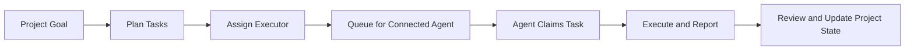

# ScopeGuard

Task orchestration and delivery coordination for multi-agent software work.

[Simplified Chinese](./README.zh-CN.md)

ScopeGuard helps you turn project goals into structured tasks, route those tasks to the right agent, and bring results back into a shared project state.

It is not a coding model.
It is not an IDE replacement.
It works alongside Claude, Codex, OpenCode, and other MCP-compatible or connected agents.

## In One Sentence

ScopeGuard is an orchestration layer for AI software work: `plan -> queue -> execute -> report -> review`.

## Product Position

ScopeGuard is most useful when you are coordinating real project work across one or more agents.

It is designed to provide:

- project-level planning and task breakdown
- task routing through `assignedExecutor`
- structured handoff contracts
- connected agent queueing and status tracking
- result, review, and project-state feedback loops

ScopeGuard should be understood as:

- an orchestration core
- a connected / MCP-friendly integration layer
- an optional automation layer on top

It should not be understood as:

- a universal local CLI runtime
- a replacement for Claude or Codex
- a tool whose main value is launching shell processes

## Core Idea

Most coding agents are good at doing one task.
They are much less reliable at:

- breaking a project into a clean task graph
- coordinating multiple executors
- preserving scope and review context
- reporting completed work back into shared state

ScopeGuard exists to solve that orchestration gap.

## What ScopeGuard Owns

ScopeGuard is responsible for:

- project planning
- task lifecycle
- task handoff structure
- assignment queueing
- connected client visibility
- review and approval state
- project memory and coordination context

Executors are responsible for:

- editing code
- running commands
- returning results

Humans are responsible for:

- choosing goals
- reviewing outcomes
- approving next steps

## Product Layers

### 1. Orchestration Core

This is the core product value.

It includes:

- project conversations
- task schema
- dependencies, priority, and parallelism
- `assignedExecutor`
- handoff generation
- queue / claim / complete lifecycle
- review and status reporting

### 2. Standard Connected Interface

This is the standard integration surface.

It includes:

- connected HTTP API
- MCP bridge
- token auth
- connected client registry
- pending assignment queue
- claim / finish / complete actions

This is the primary route for execution.

### 3. Automation Enhancements

These are optional layers on top of the connected core.

They include:

- skill / command workflows
- MCP prompts
- optional companion workers
- experimental local CLI launch

These are useful, but they do not define what ScopeGuard is.

## Recommended Main Workflow

1. Describe a goal in the project conversation.
2. Use planning to turn that goal into tasks.
3. Assign each task to an executor.
4. Connect one or more agents through MCP / connected integration.
5. Queue a task for a matching connected agent.
6. Let the agent claim, execute, and report results.
7. Review the result and decide the next step.



## Connected MCP Workflow

ScopeGuard's connected MCP workflow enables agents to discover, claim, and report on tasks through a standard MCP interface:

1. **Connect** — The agent connects to ScopeGuard's MCP bridge using a token.
2. **Discover** — The agent calls `scopeguard_list_pending` to find queued assignments.
3. **Claim** — The agent calls `scopeguard_claim_assignment` to lock a task, receiving a structured handoff with goal, allowed files, and acceptance criteria.
4. **Execute** — The agent works within the handoff's constraints and reports completion via `scopeguard_finish_assignment`.
5. **Review** — Results flow back into the project for human or automated review.

This four-step cycle (`status → list_pending → claim → finish`) is the primary agent interaction pattern. The MCP bridge handles auth, queue ordering, and structured handoff serialization, so agents can focus on executing tasks rather than managing workflow state.

## Current Execution Priority

### Primary

Connected / MCP-style execution.

This is the direction we expect to harden:

- connected agents
- assignment queue
- claim / finish / complete
- MCP bridge
- skill / prompt workflows

### Secondary

Skill or command workflows on top of MCP.

This is the most host-friendly path for guided task execution without requiring a background worker.

### Experimental / Fallback

Local CLI launch from inside ScopeGuard.

This remains available for debugging and fallback scenarios, but it is not the product's primary execution story.

## Who It Is For

ScopeGuard is a good fit if:

- you use multiple coding agents on real projects
- you want a stable task model instead of scattered chat transcripts
- you want connected execution and structured result reporting
- you need reviewable project state, not just "the model said it finished"

It is probably overkill if:

- you only do one-off edits
- you do not need task state or review structure
- you do not care which agent handled which task

## What Is Working Today

The current desktop product direction is centered on:

- explicit project planning
- task creation with executor semantics
- connected client registration
- queueing work for connected agents
- pending / claim / finish lifecycle
- MCP bridge as a generic host integration surface

## What Is Deliberately Not the Main Story

ScopeGuard is not currently trying to become:

- a universal background worker platform for every IDE
- a host-specific Claude-only integration
- a local shell launcher for every agent runtime edge case

Those may exist as adapters or optional enhancements, but they are not the core promise.

## Quick Start

### Desktop app

```powershell
pnpm install
pnpm --filter @scopeguard/desktop build
node .\apps\desktop\scripts\run-electron.mjs
```

### Connected / MCP path

1. Open ScopeGuard desktop.
2. Go to `Settings > Connected Agents / MCP`.
3. Copy the token.
4. Connect your agent or MCP host to the ScopeGuard bridge/API.
5. Queue a task for a connected agent.

### CLI / local tooling

```powershell
pnpm --filter @scopeguard/cli dev -- doctor
pnpm --filter @scopeguard/cli dev -- smoke
```

## Repo Guide

- `docs/SCOPEGUARD_PRODUCT_STRATEGY.md` - current product positioning
- `docs/SCOPEGUARD_DESKTOP_MVP.md` - desktop workflow scope
- `docs/SCOPEGUARD_DESKTOP_ARCHITECTURE.md` - architecture notes
- `docs/SCOPEGUARD_DESKTOP_ADAPTER_API.md` - connected / adapter API
- `docs/QUICKSTART.md` - developer quick start
- `docs/COMMANDS.md` - CLI commands

## Status

ScopeGuard is in active product-definition and developer-preview mode.

The central question is no longer "can we launch a local CLI?".
The central question is:

"Can we give projects a stable orchestration layer that multiple agents can plug into?"

That is the direction this repository now optimizes for.
