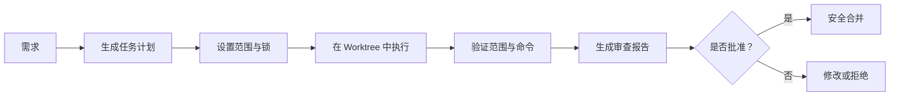

# ScopeGuard

[English](./README.md)

面向 AI 编码工作流的安全编排工具。

ScopeGuard 帮你在使用 AI 生成代码变更时，获得更清晰的文件边界、更安全的并行协作，以及更容易审查的输出结果。

它不是编码模型。
它与 Codex、Claude Code、Cursor 等编码助手配合使用，而不是替代它们。

## 一句话说明

ScopeGuard 帮你在 AI 写出的代码进入主分支之前，先把风险管住。

## 它为什么存在

AI 编码工具很擅长“做出改动”。
但它们并不擅长稳定地遵守文件边界、协调并行任务，或者在合并前产出容易验证的结果。

这类问题通常会表现为：

- agent 修改了超出预期的文件
- 并行任务之间出现重叠改动
- 生成产物混进源码 diff
- 工作区改动难以人工审查
- AI 看起来“完成了”，但合并过程依然不安全

ScopeGuard 的作用，就是给这套流程加上一层安全护栏。

## 没有 ScopeGuard / 使用 ScopeGuard

没有 ScopeGuard：

- 直接让 AI 工具去改代码
- 事后再看一大坨 diff
- 在 review 或 merge 时才发现越界修改
- 手动拆解并行任务之间的冲突

使用 ScopeGuard：

- 先定义任务和文件边界
- 在独立的 git worktree 中隔离执行
- 在信任结果前先验证是否越界
- 在批准和合并前先生成可审查的报告

## ScopeGuard 能做什么

- 将工作拆成带明确文件边界的任务
- 通过文件锁和任务依赖避免不安全的并行执行
- 在隔离的 git worktree 中运行任务
- 验证任务是否超出允许范围
- 在批准和合并前生成人工审查报告
- 当改动直接发生在当前工作区时，支持 working-tree 验证

## 适合谁使用

ScopeGuard 最适合这些场景：

- 你在真实仓库里重度使用 AI 编码工具
- 多个任务可能并行执行
- 你希望 AI 产出的代码在 review 和 merge 前更安全、更可控
- 你需要的不只是“模型说它做完了”

它大概率不适合这些场景：

- 很小的脚本项目
- 只改 1 到 2 个文件的轻量任务
- 没有 review 要求的随手探索式 prompting

## 核心理念

ScopeGuard 不尝试取代你的编码助手。

它做的是把 AI 编码从一次性的生成动作，变成一条可控的工程流程：

`plan -> scope -> run -> verify -> review -> approve -> merge`

## 典型工作流

1. 描述需求并生成任务计划。
2. 导入带有 `allowedFiles`、锁和依赖关系的任务。
3. 在独立 worktree 中运行单个任务。
4. 在信任结果前先执行验证。
5. 查看生成的 diff 和审查报告。
6. 只有在范围检查和审查都通过后才批准和合并。



## 快速开始

```powershell
pnpm install
pnpm build
pnpm --filter @scopeguard/cli dev -- init
pnpm --filter @scopeguard/cli dev -- scan
pnpm --filter @scopeguard/cli dev -- doctor
pnpm --filter @scopeguard/cli dev -- smoke
```

## 最小可用入口

如果你暂时不想使用完整任务流，可以先从验证和审查开始：

```powershell
scopeguard verify T-001 --working-tree
scopeguard review T-001 --working-tree
scopeguard verify T-001 --working-tree --scope-only
```

这是验证 ScopeGuard 是否对你的仓库有价值的最快方式。

它先帮你回答一个很实际的问题：

“这次 AI 生成的改动，是否真的只落在我预期的文件和边界里？”

## 核心流程

```powershell
scopeguard plan requirements/feature.md
scopeguard validate-plan plan.json
scopeguard import-plan plan.json
scopeguard tasks
scopeguard next
scopeguard schedule
scopeguard verify T-001
scopeguard review T-001
```

源码运行说明：
把 `scopeguard ...` 替换为以下任意一种形式：

- `pnpm --filter @scopeguard/cli dev -- ...`
- `node apps\cli\bin\scopeguard.js ...`

## 手动 Working-Tree 工作流

当改动不是在任务 worktree 中产生，而是直接发生在当前仓库工作区时，使用这个模式：

```powershell
scopeguard verify T-001 --working-tree
scopeguard review T-001 --working-tree
scopeguard verify T-001 --working-tree --scope-only
scopeguard verify T-002 --working-tree --include-dependencies
```

## 兼容性

- `scopeguard` 是主 CLI 命令
- `agentboard` 仍作为兼容旧版本的别名保留
- `.scopeguard` 是主数据目录
- `.agentboard` 仅用于兼容旧数据

## 本地 CLI 用法

```powershell
pnpm --filter @scopeguard/cli dev -- doctor
pnpm --filter @scopeguard/cli dev -- smoke
node apps\cli\bin\scopeguard.js doctor
node apps\cli\bin\scopeguard.js smoke
node apps\cli\bin\agentboard.js doctor
node apps\cli\bin\agentboard.js smoke
```

## Web 和 TUI

```powershell
pnpm --filter @scopeguard/cli dev -- board
pnpm --filter @scopeguard/cli dev -- tui
```

## 第一次试用时建议重点关注

如果你第一次尝试 ScopeGuard，建议先看这几个问题：

- `verify` 有没有抓到你在 review 时可能漏掉的文件
- `working-tree` 模式是否适合你现在直接让 AI 修改真实仓库的方式
- 任务边界是否让并行工作变得更安全
- `review` 这一步是否让 AI 输出更容易被信任或拒绝

## 当前状态

ScopeGuard 目前处于 Developer Preview 阶段。
这套工作流已经可以用于 dogfooding 和真实仓库测试，但界面和使用体验仍在持续迭代中。

## 更多文档

- `docs/QUICKSTART.md`
- `docs/COMMANDS.md`
- `docs/MVP_WORKFLOW.md`
- `docs/SAFETY_MODEL.md`
- `docs/DOGFOOD.md`
- `docs/PREVIEW_LIMITATIONS.md`
