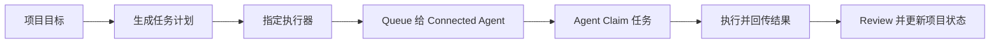

# ScopeGuard

面向多 Agent 软件协作的任务编排与交付协调层。

[English](./README.md)

ScopeGuard 用来把项目目标拆成结构化任务，把任务路由给合适的执行器，并把执行结果重新收回到统一的项目状态里。

它不是编码模型。
它不是 IDE 替代品。
它与 Claude、Codex、OpenCode 以及其他支持 MCP 或 connected integration 的 agent 协作。

## 一句话

ScopeGuard 是 AI 软件工作的编排层：`plan -> queue -> execute -> report -> review`。

## 产品定位

ScopeGuard 最适合解决“真实项目中的多 agent 协作”问题。

它提供的是：

- 项目级 planning 和 task breakdown
- 基于 `assignedExecutor` 的任务路由
- 结构化 handoff 契约
- connected agent 的 queue 与状态跟踪
- 结果、review 和 project state 的回流

你应该把 ScopeGuard 理解成：

- 编排核心
- connected / MCP 友好的标准接入层
- 可选的自动化增强层

而不应该把它理解成：

- 通用本地 CLI runtime
- Claude 或 Codex 的替代品
- 一个以启动 shell 进程为主要价值的工具

## 核心问题

大多数 coding agent 擅长完成单个任务，但不擅长：

- 把项目目标稳定拆成任务图
- 协调多个执行器
- 保持 scope、review 和上下文连续
- 把结果结构化回写到项目状态

ScopeGuard 的意义，就是补这层 orchestration gap。

## ScopeGuard 负责什么

ScopeGuard 负责：

- project planning
- task lifecycle
- task handoff 结构
- assignment queue
- connected client 可见性
- review 与 approval 状态
- project memory 与协调上下文

执行器负责：

- 写代码
- 跑命令
- 返回结果

人负责：

- 决定目标
- 审查结果
- 批准下一步

## 产品三层结构

### 1. Orchestration Core

这是 ScopeGuard 的核心价值层。

包含：

- project conversation
- task schema
- dependencies、priority、parallelism
- `assignedExecutor`
- handoff 生成
- queue / claim / complete 生命周期
- review 与状态回写

### 2. Standard Connected Interface

这是标准接入层。

包含：

- connected HTTP API
- MCP bridge
- token auth
- connected client registry
- pending assignment queue
- claim / finish / complete 动作

这也是当前推荐的执行主路线。

### 3. Automation Enhancements

这是建立在 connected core 之上的增强层。

包含：

- skill / command workflow
- MCP prompts
- optional companion worker
- experimental local CLI launch

这些能力有用，但它们不定义 ScopeGuard 本身。

## 推荐主流程

1. 在 Project 页描述目标
2. 用 planning 把目标拆成 tasks
3. 给每个 task 指定 executor
4. 通过 MCP / connected integration 接入一个或多个 agent
5. 把 task queue 给匹配的 connected agent
6. 让 agent claim、执行并回传结果
7. review 结果并决定下一步



## Connected MCP Workflow（连接式 MCP 工作流）

ScopeGuard 的 connected MCP workflow 让 agent 通过标准 MCP 接口发现、认领和汇报任务：

1. **连接** — Agent 使用 token 连接到 ScopeGuard 的 MCP bridge。
2. **发现** — Agent 调用 `scopeguard_list_pending` 查看待处理的 assignment。
3. **认领** — Agent 调用 `scopeguard_claim_assignment` 锁定一个任务，拿到包含 goal、allowedFiles 和 acceptance criteria 的结构化 handoff。
4. **执行** — Agent 在 handoff 约束内完成工作，通过 `scopeguard_finish_assignment` 回传结果。
5. **审查** — 结果回流到项目中，供人工或自动化 review。

这四步循环（`status → list_pending → claim → finish`）是最主要的 agent 交互模式。MCP bridge 负责 auth、queue 排序和 handoff 序列化，让 agent 专注于执行任务本身而非管理工作流状态。

## 当前执行优先级

### 主路线

Connected / MCP-style execution。

这也是当前要重点打磨的能力：

- connected agents
- assignment queue
- claim / finish / complete
- MCP bridge
- skill / prompt workflow

### 次路线

建立在 MCP 之上的 skill / command workflow。

这是更容易被宿主接受的引导式执行方式，不依赖后台 daemon。

### 实验性 / fallback

从 ScopeGuard 内直接启动本地 CLI。

它仍然保留，但主要用于调试与兜底，不再是默认执行主线。

## 适合谁

如果你符合下面这些情况，ScopeGuard 会很有价值：

- 你在真实项目里混合使用多个 coding agent
- 你想要稳定的任务模型，而不是散落在聊天记录里的上下文
- 你需要 connected execution 和结构化结果回传
- 你关心 review、状态和交付过程，而不只是“模型说做完了”

如果你只是：

- 做一次性小改动
- 不需要 task state
- 不关心哪个 agent 执行了哪个任务

那 ScopeGuard 可能偏重。

## 当前真正跑通的方向

当前桌面产品正在收敛到这条主线：

- 显式 project planning
- 带 executor 语义的 task
- connected client 注册与在线状态
- queue assignment 给 connected agent
- pending / claim / finish 生命周期
- 通过 MCP bridge 作为通用 host 接入面

## 明确不是主故事的方向

ScopeGuard 现在不打算把这些作为主价值：

- 通吃所有 IDE 的后台 worker 平台
- Claude-only 的特供接入
- 处理所有本地 CLI 启动兼容细节

这些可以作为 adapter 或增强层存在，但不是核心承诺。

## 快速开始

### Desktop app

```powershell
pnpm install
pnpm --filter @scopeguard/desktop build
node .\apps\desktop\scripts\run-electron.mjs
```

### Connected / MCP 路线

1. 打开 ScopeGuard Desktop
2. 进入 `Settings > Connected Agents / MCP`
3. 复制 token
4. 把 agent 或 MCP host 接到 ScopeGuard bridge/API
5. 将 task queue 给 connected agent

### CLI / 本地工具

```powershell
pnpm --filter @scopeguard/cli dev -- doctor
pnpm --filter @scopeguard/cli dev -- smoke
```

## 仓库导读

- `docs/SCOPEGUARD_PRODUCT_STRATEGY.md` - 当前产品定位
- `docs/SCOPEGUARD_DESKTOP_MVP.md` - 桌面流程范围
- `docs/SCOPEGUARD_DESKTOP_ARCHITECTURE.md` - 架构说明
- `docs/SCOPEGUARD_DESKTOP_ADAPTER_API.md` - connected / adapter API
- `docs/QUICKSTART.md` - 开发者快速开始
- `docs/COMMANDS.md` - CLI 命令

## 当前状态

ScopeGuard 目前处于产品定位收敛期和 Developer Preview 阶段。

现在最重要的问题已经不是：

“能不能顺利启动某个本地 CLI？”

而是：

“能不能为多 agent 软件协作提供一个稳定、可连接、可回流的编排层？”

这个仓库现在就是围绕这个方向持续收敛的。
