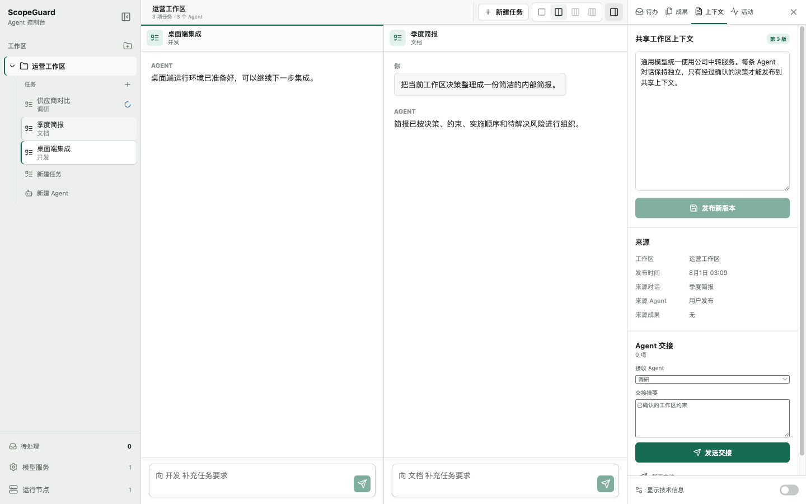

# ScopeGuard

本地优先的多 Agent 桌面工作台，面向通用知识工作。

[English](./README.md)

ScopeGuard 让用户在一个 Workspace 中同时打开多个持久对话，由不同 Agent
并行工作，同时避免隐式共享上下文。对话创建后固定使用所选 Agent；运行时可以
切换该 Agent 支持的模型，但不会更换执行 Harness。



正式产品形态是 Electron 桌面端。Web 仅用于快速迭代和预览渲染层，不具备
文件、命令、模型请求或密钥能力。

## 当前产品核心

- 创建可选本地目录的 Workspace。
- 在同一工作区中并列显示 1-4 个持久对话。
- 配置 OpenAI-compatible 或 Anthropic-compatible 模型服务。
- 每个对话固定一个 ScopeGuard 原生 Agent，运行时可选择模型。
- 每个 Run 独立执行、停止和重试，并支持审批及用户补充信息后续跑。
- 提供“请求批准”“自动审批”“完全访问”三档会话权限。
- 本地文件工具受真实路径边界约束，命令通过受管理的工具执行。
- 通过 Project Context 显式共享用户确认的信息；各对话记录默认隔离。
- 使用 SQLite 恢复对话、Run、用量、布局和草稿。

ScopeGuard 不再管理外部 Agent CLI 或常驻远端 Runtime。高级 CLI 可以通过
独立终端打开，但不进入 ScopeGuard 的 Run 生命周期。企业知识库是通过 MCP
接入的独立系统，其 RAG 索引不内置在 ScopeGuard 中。

当前里程碑是单用户、本地优先版本，不包含团队账号、云同步、模型托管、VPN
或自动跨 Agent 路由。

## 从源码启动

需要 Node.js 22 或更高版本，以及 pnpm 10 或更高版本。

```bash
pnpm install
pnpm dev
```

仅预览前端：

```bash
pnpm dev:web
```

Web 预览使用内存 bridge，不能替代桌面验收。

## 验证

```bash
pnpm test
pnpm typecheck
pnpm build
git diff --check
```

运行 `pnpm smoke:provider` 可启动本地可重复 Provider，地址为
`http://127.0.0.1:47821/v1`。

## 架构

```text
apps/desktop              Electron 主进程、preload、渲染层、Agent host
packages/domain           核心实体与状态转换
packages/application      对话和 Run 用例
packages/agent-runtime    原生模型与工具循环
packages/provider-adapters
packages/tool-runtime     受目录边界约束的文件和命令工具
packages/storage-sqlite   SQLite schema 与向前迁移
packages/ipc-contracts    运行时校验的桌面 IPC 契约
```

SQLite schema 仍保留旧控制平面表，用于让已有本地数据库非破坏性迁移。这些表
不是当前产品能力，也不再由核心应用接口暴露。

详细边界见 [V2_ARCHITECTURE.md](./docs/V2_ARCHITECTURE.md)、
[SECURITY.md](./docs/SECURITY.md) 和
[VERIFICATION.md](./docs/VERIFICATION.md)。
